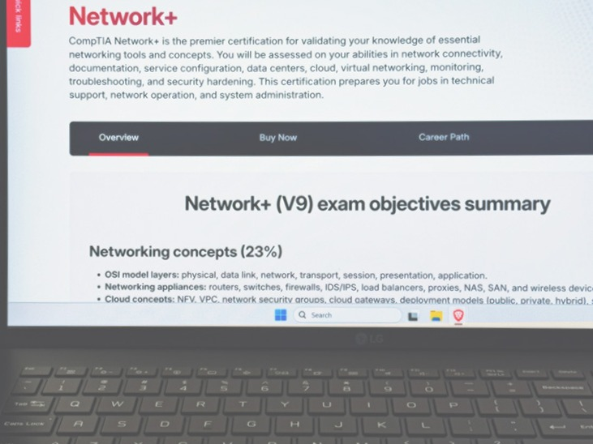

I’m Network+ certified and it feels like I can see a path ahead. I've come to appreciate and understand certificates help
freshen up what I know and offer tangible proof of my skills. When I first got my foot in the door, I assumed I only needed
the A+ cert for the initial step into the field and from there I could move up based on experience alone. I didn't realize
how valuable being certified was until I started talking to people and doing research.

Studying for the exam, I used resources from Andrew Ramdayal, Anthony Dion, and Jason Messer. The reason I used multiple
teachers was to help ensure there were less gaps in my knowledge. After studying for a bit and getting the information in
my head, I scheduled the exam. I had read online from multiple people that studying too long can actually be detrimental
and cause burnout which was one reason why I didn't want to delay too much. For myself, 30-60 days seems like a good range
to stay within.
<!-- more -->

As the date started approaching, I took practice tests to help identify weak spots and then looked over the study material
I was not as strong in. I then took more practice tests in the following days. I really liked Andrew Dion's tests in
particular because of the changing questions each time it's taken. Another I liked was Andrew Ramdayal's test on YouTube. For
each questions he mentions why the right answer is right and the wrong answers are wrong and I would highly recommend both
for taking practice tests. Something that may be useful, when doing video based practice exams, I keep a long tally list of
0s and 1s, one line per question, and then calculate my score using Excel. You may want to try it.

Before I knew it, it was time. I went to the Pearson VUE center feeling a bit anxious. They provided me some earplugs and a
whiteboard, and lead me into one of the rooms. In the room there were multiple computers. I picked one and sat down. While
taking the test I realized I still had some gaps in my knowledge and I was feeling a it anxious. I had put the earplugs in
early on but had to take them out. The lack of sound was actually causing me to be more nervous and it felt like time was
flying by.

I left the lab tests for last. I knew I wouldn't be able to get through them completely but I did my best with the little
remaining time I had. Then I was done. I went through the exam and completed the questionnaire at the end which I really
think should be displayed after you see your score or not at all.

Finally, there was my score on the screen and a smile formed on my face. I passed. That's when the weight lifted and I couldn't
help but smile for the rest of the day. It was a great feeling. I could feel my confidence lifted and even now, it's still high.

I can see my career stretching out in front of me now and I'm planning on pursuing the Security+ next. It's one of the most
valuable foundational certifications in IT. When it comes to career advancement, it seems to be more valuable than Network+.
I look forward to the future. I don't know where the journey will take me but I know it's going to be an interesting ride
along the way.
