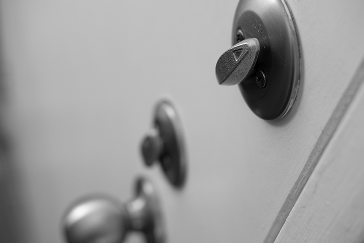

Right after Network+, I've passed the Security+ exam. It feels I'm inching closer 
and closer to something. Now that I'm on the other side, I'm more knowledgeable
and ready to learn what's next.

When I started studying for the exam, I realized the difference immediately in the type of
knowledge. This felt more general, less technical. It was like pulling back and looking
at the forest around you instead of being caught up in the trees.

From my past Network+ exam experience, I decided again I would limit the amount of time I
would study. Understand the knowledge but don't dwell or fall down rabbit holes. I can dig
deeper after I'm certified.

I am starting to realize for me the best process is to watch a whole lecture series from start
to finish, stopping if needed just enough to understand what is necessary. I'll then schedule
my exam a week or two out, do practice tests, go back and focus on my weak points, do more practice
tests, and then take the exam.

I didn't feel as nervous this time. I actually was done with time to spare and even felt confident
that I would pass. I think the saying, "The more you do, the more you can do." is pretty apt here.

Thank you Anthony Dion, Andrew Ramdayal, Jason Messer, and Dennis Kraft.

Onwards I go. ⛵
